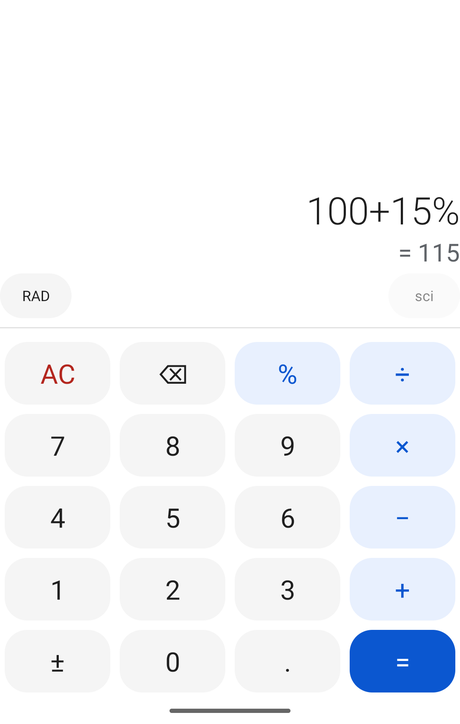
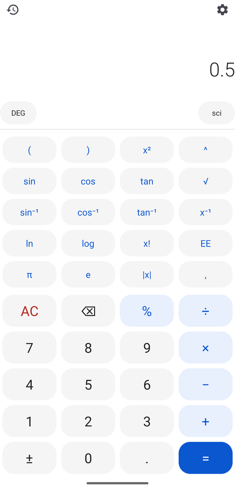
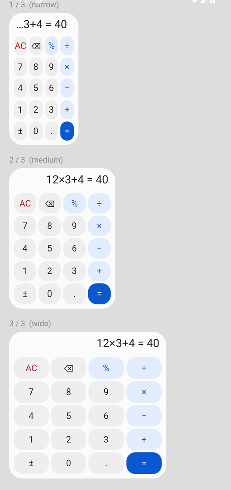
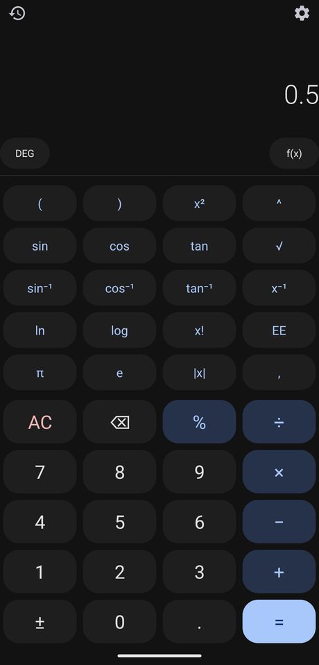
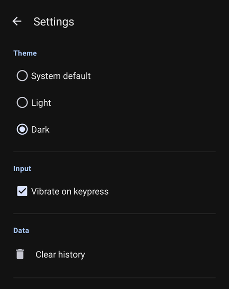
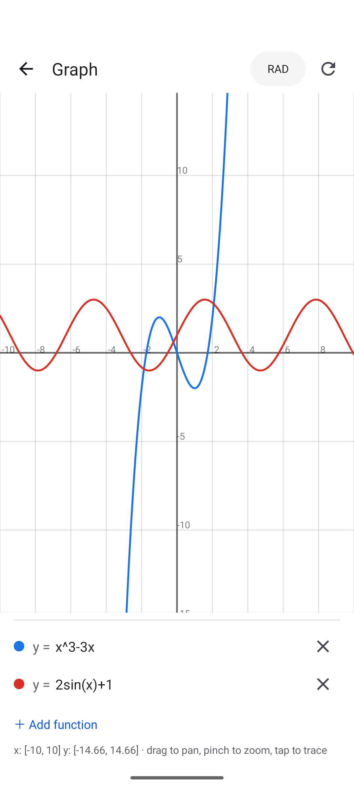
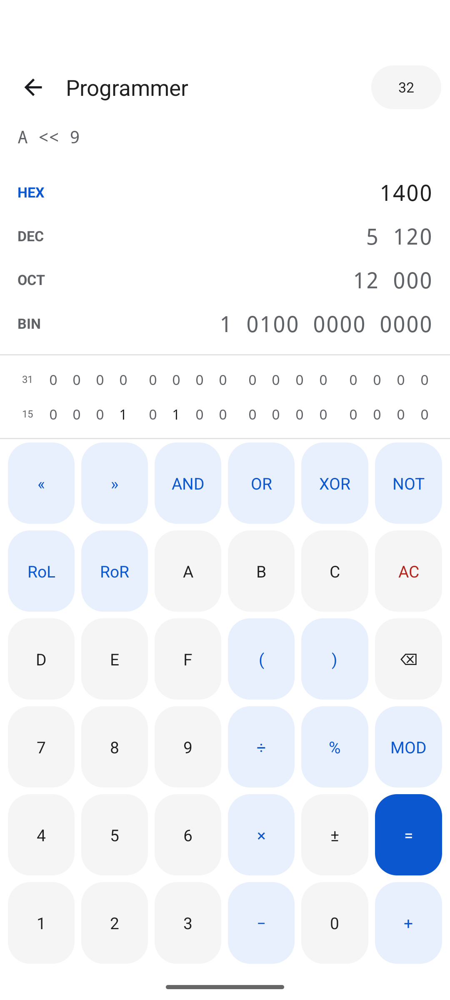
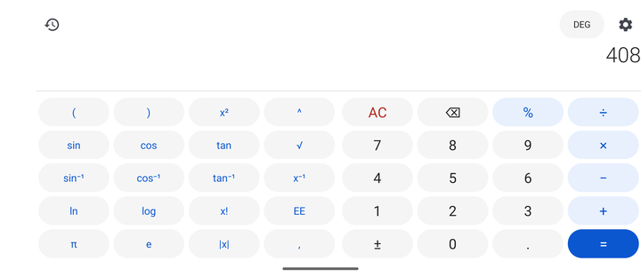

# CalcPlus

A tiny, permission-free calculator for Android — built for GrapheneOS,
distributed via Obtainium.

- **No permissions.** The manifest declares none. Not `INTERNET`, nothing.
- **Small.** One Rust `.so` (~435 KB, arm64 only), no Compose, no AppCompat,
  no Material library. Release APK ≈ **610 KB**.
- **Rust core, Kotlin shell.** All arithmetic lives in `calc-core` (Rust,
  `no_std`); Kotlin does UI and the widget.
- **Interactive lock-screen widgets.** Two: a compact basic keypad (responsive
  across the 1/3, 2/3 and 3/3 lock-screen columns) and a full scientific one
  meant to be sized large. Every key is a self-targeted broadcast, so they work
  while the device is locked.
- **Works like the stock calculator.** Circular keys that compress into
  rounded rectangles when you tap **sci**, live result preview, a horizontally
  scrolling formula, persistent history, copy/paste, digit grouping, keypress
  haptics, a **Light / Dark / System** theme, and a landscape layout with both
  keypads side by side. Rotates cleanly; the expression survives the rotation.
  See [FEATURES.md](FEATURES.md) for a point-by-point comparison.
- **Graphing.** `y = f(x)` plots for up to four functions — drag to pan, pinch
  to zoom, tap to trace. A **CALC** menu with the TI-84 tools: value, zero,
  minimum, maximum, intersect, dy/dx and ∫f(x)dx (which shades the area). The
  calculator also takes `integral(f, a, b)` directly.
- **Programmer mode.** Integer maths — signed or unsigned, 8/16/32/64-bit — and
  float maths: IEEE presets (half, bfloat16, float, double) or a **custom**
  sign/exponent/mantissa layout. Live BIN / OCT / DEC / HEX readout, a tappable
  bit grid (sign/exponent/mantissa colour-coded for floats), bitwise ops,
  shifts, rotations, two's-complement, and base-aware digit entry.

## Screenshots

<p align="center">
  
  &nbsp;
  
  &nbsp;
  
</p>
<p align="center">
  
  &nbsp;
  
</p>
<p align="center">
  
  &nbsp;
  
</p>
<p align="center">
  
</p>

## Status — Phases 0–5, graphing subset still growing

| Phase | Scope | State |
|------:|-------|-------|
| 0 | Toolchain, JNI bridge, CI, reproducible-ish build | ✅ |
| 1 | Decimal calculator: `+ − × ÷ ^ %`, parens, `±`, history | ✅ |
| 2 | Interactive home/lock-screen widget, responsive sizes | ✅ |
| 3 | Scientific: trig + inverses, hyperbolics, logs, roots, `nCr`/`gcd`, DEG/RAD/GRAD | ✅ |
| 4 | TI-84 graphing | 🔨 plot / pan / zoom / trace + CALC menu (zero, min/max, intersect, dy/dx, ∫) done; TABLE, matrices, stats next |
| 5 | Programmer calculator: signed/unsigned ints, IEEE + custom floats, bitwise, shifts, rotations, bit grid | ✅ |

## Layout

```
core/                 Cargo workspace
  calc-core/           lexer · Pratt parser · decimal evaluator + programmer
                       (fixed-width int / float) engine, all no_std
  calc-ffi/            JNI bridge -> libcalc.so
android/
  app/                 Kotlin: MainActivity, SettingsActivity, HistoryActivity,
                       GraphActivity + GraphView, ProgrammerActivity + ProgDoc,
                       widget/ (basic + full-scientific AppWidgetProviders),
                       CalcDoc (pure input model), CalcEngine (JNI wrapper)
```

Theme switching is done without AppCompat — `BaseActivity` overrides the night
bit of the `Configuration` in `attachBaseContext`, so `-night` resources
resolve to the chosen mode and the manifest stays dependency- and
permission-free.

The engine is `Decimal` (base-10, 28–29 significant digits) — the same kind of
arithmetic a TI-84 does, so `0.1 + 0.2 == 0.3`. It is *not* a CAS: `1/3`
displays as `0.333333333333`, not as a fraction. Graphing samples each curve
through the engine (`calc_core::sample`), so plotted functions accept the same
syntax as the calculator, including implicit multiplication (`2x`, `3(x+1)`).

Programmer mode uses a **separate** engine (`calc_core::programmer`): a small
Pratt parser with two evaluators. Integer arithmetic runs in `u128` with
wrapping semantics, masked to the word size after every step, so it wraps
exactly as a hardware register would. Float arithmetic runs in `f64`, then the
result is rounded (ties to even) to the nearest value representable by the
chosen `sign` / `exponent` / `mantissa` layout — `f32` / `f64` use the native
conversion, anything else a generic minifloat encoder. Subnormals, `±∞` and
`NaN` are handled; `inf` / `nan` are also accepted as literals.

## Building

Prerequisites: JDK 17, Android SDK (API 36, build-tools 36, NDK
`27.2.12479018`), Rust `1.96.1` with the `aarch64-linux-android` target, and
`cargo-ndk` (`cargo install cargo-ndk`).

```sh
# Rust engine
cd core && cargo test

# App (Gradle drives cargo-ndk automatically via the :app:cargoNdkBuild task)
cd ../android
./gradlew :app:assembleRelease      # -> app/build/outputs/apk/release/
```

### Release signing

Create `android/keystore.properties` (git-ignored):

```properties
storeFile=/absolute/path/to/upload.jks
storePassword=…
keyAlias=upload
keyPassword=…
```

Without it, `assembleRelease` produces an **unsigned** APK (CI signs it).

## Running it locally

[`run.sh`](run.sh) builds the app and puts it on a device or emulator:

```sh
./run.sh                 # build, boot the emulator in a window, install, launch
./run.sh --headless      # no window (pair with --screenshot / --logcat)
./run.sh --no-build      # skip Gradle, just reinstall the last build
./run.sh --logcat        # follow the app's log after launching
./run.sh --screenshot    # save ./calcplus.png and exit
./run.sh --stop          # shut the emulator down
```

- A phone connected over adb (USB via `usbipd-win`, or wireless `adb connect`)
  is always preferred over the emulator.
- The emulator window needs WSLg (Windows 11). It also needs KVM: you're in the
  `kvm` group, but run `wsl --shutdown` from Windows PowerShell **once** so the
  session picks it up — otherwise `run.sh` falls back to a slower `newgrp`
  relaunch, and without the group at all it's unusably slow.
- First run creates the `calc36` AVD (Pixel 7, API 36) automatically.

## Distribution

Point Obtainium at this repo's GitHub Releases. Config: [`obtainium.json`](obtainium.json).
Releases are built and signed by [`.github/workflows/release.yml`](.github/workflows/release.yml)
on a `v*` tag.

## Lock-screen widget notes

- Widget category is `home_screen`; Android 16 QPR2 / GrapheneOS surface those
  on the lock-screen widget page. No separate keyguard widget API is used
  (that was removed in Android 5 and not brought back).
- Keypad taps are self-targeted **broadcasts** → they run while locked.
- Tapping the **display** opens the full app — the only action that prompts an
  unlock.
- Three `RemoteViews` breakpoints (narrow/medium/wide) map to the 1/3, 2/3,
  3/3 columns; they differ only in text size so nothing clips.

## App ID

`io.github.kmarzouq.calcplus` — the permanent package identity (reverse-DNS of
the GitHub namespace). The display name is `CalcPlus`
(`app_name` string). Debug builds get a `.debug` suffix so both can be
installed side by side.

## License

[GNU General Public License v2.0 only](LICENSE). SPDX: `GPL-2.0-only`.
All third-party dependencies are permissively licensed (MIT / Apache-2.0), so
they impose no additional conditions.
